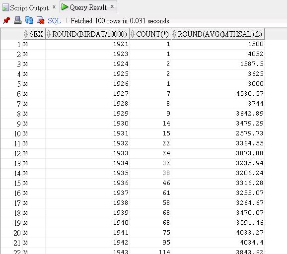

### MongoDB aggregation pipeline <br />--- "Don't worry about being old, worry about thinking old"


### I. Semantics 
SQL Server brings in their unparalleled power in the complete arbitrary of connecting tables from databases without a taint of difficulty. All this empowers administrators in solving complex analytic and statistic issues at large. We write SQL and thus think in SQL regularly without second thought and tend to profess that it is the most natural and only way of doing things. Not until the dawn of NoSQL database, do people realize there is another approach to organize, access and connect the data. 

To test drive the following statement against Oracle: database: 
```sql
EXPLAIN PLAN FOR 
SELECT sex, round(birdat/10000), count(*), round(avg(mthsal), 2) 
FROM member 
WHERE birdat > 19000101 AND sex IN ('M', 'F') 
GROUP BY sex, round(birdat/10000)
ORDER BY 1 DESC, 2; 

SELECT * FROM table(dbms_xplan.display);
```

Output: 
```
Plan hash value: 3379579560
 
-----------------------------------------------------------------------------
| Id  | Operation          | Name   | Rows  | Bytes | Cost (%CPU)| Time     |
-----------------------------------------------------------------------------
|   0 | SELECT STATEMENT   |        | 21992 |   257K|   685   (1)| 00:00:01 |
|   1 |  SORT GROUP BY     |        | 21992 |   257K|   685   (1)| 00:00:01 |
|*  2 |   TABLE ACCESS FULL| MEMBER | 25425 |   297K|   683   (1)| 00:00:01 |
-----------------------------------------------------------------------------
 
Predicate Information (identified by operation id):
---------------------------------------------------
 
   2 - filter("BIRDAT">19000101 AND ("SEX"='F' OR "SEX"='M'))
```
The running result could be: 



As you can see, every thing has a cost, any SQL statement to be executed has to be parse (either soft parse of hard parse), an execution plan is devised and get executed behind the scenes. Typically, aggregation in SQL statement is specified in a kind of Denotational Semantics, ie. you vaguely tell what you want without telling how; while the counterpart is specified in Operational Semantics, ie. a stage-by-stage of execution.  

--- 
- Operational Semantics (操作語義) – the execution of the language is described directly. 
- Denotational Semantics (指稱語義) – each phrase in the language is interpreted as a conceptual meaning that can be thought of abstractly. 
- Axiomatic Semantics (公理語義) – meaning to phrases is given by describing the logical axioms that apply to them.


### II. [Aggregation Pipeline](https://www.mongodb.com/docs/manual/core/aggregation-pipeline/)

An aggregation pipeline consists of one or more stages that process documents:

- Each stage performs an operation on the input documents. For example, a stage can filter documents, group documents, and calculate values.

- The documents that are output from a stage are passed to the next stage.

- An aggregation pipeline can return results for groups of documents. For example, return the total, average, maximum, and minimum values.

Similarly, aggregation in MongoDB could be: 
```
const database = 'aggree';
use(database);
db.users.aggregate([
    {   // Stage 1
        $group: {
          _id: ["$gender", "$age"],
          count: {
            $sum: 1
          },
          average: {
            $avg: "$mthsal"
          }
        }
    },
    {   // Stage 2 
        $sort: {
          "_id.0": -1,
          "_id.1": -1
        }        
    }
]);
```
Output: 
```
[
  {
    "_id": [
      "male",
      40
    ],
    "count": 21,
    "average": null
  },
  {
    "_id": [
      "male",
      39
    ],
    "count": 27,
    "average": null
  },
. . . 
```

### III. Quiz 
1. How many users are active ?
2. What is the average age of all users ?
3. List the top 5 most common favorite fruits among the users ?
4. Find the total number of male and female ?
5. Which country has the highest number of registered user ?
6. List all unique eye color present in the collection ?
7. What is the average number of tags per user ? 
8. How many users have 'enim' as one of their tags ? 
9. What are the name and age of user who are inactive and have 'velit' as a tag ? 
10. How many users have a phone number starting with '+1 (940)' ? 
11. Who has registered the most recently ? 
12. Categorize users by their favorite fruit ? 
13. How many users have 'ad' as the second tag in their list of tags ? 
14. Find user have both 'enim' and 'id' as their tag ? 
15. List all the companies located in USA with their corresponding user count ? 
16. Lookup exercise. 


### IV. Reference
1. [Complete MongoDB aggregation pipeline course | Hitesh Choudhary](https://youtu.be/vx1C8EyTa7Y)

2. [Working with MongoDB in Visual Studio Code](https://code.visualstudio.com/docs/azure/mongodb)

3. [MongoDB $match (aggregation)](https://www.mongodb.com/docs/manual/reference/operator/aggregation/match/)

4. [MongoDB $group (aggregation)](https://www.mongodb.com/docs/manual/reference/operator/aggregation/group/)

5. [MongoDB $sort (aggregation)](https://www.mongodb.com/docs/manual/reference/operator/aggregation/sort/)

6. [MongoDB $lookup (aggregation)](https://www.mongodb.com/docs/manual/reference/operator/aggregation/lookup/)

7. [How do I display and read the execution plans for a SQL statement](https://blogs.oracle.com/optimizer/post/how-do-i-display-and-read-the-execution-plans-for-a-sql-statement)

8. [The Mystery of Edwin Drood](https://www.gutenberg.org/cache/epub/564/pg564-images.html)


### EOF (2024/02/19)
